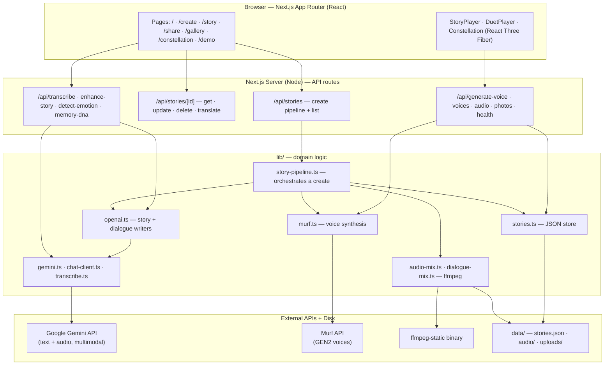
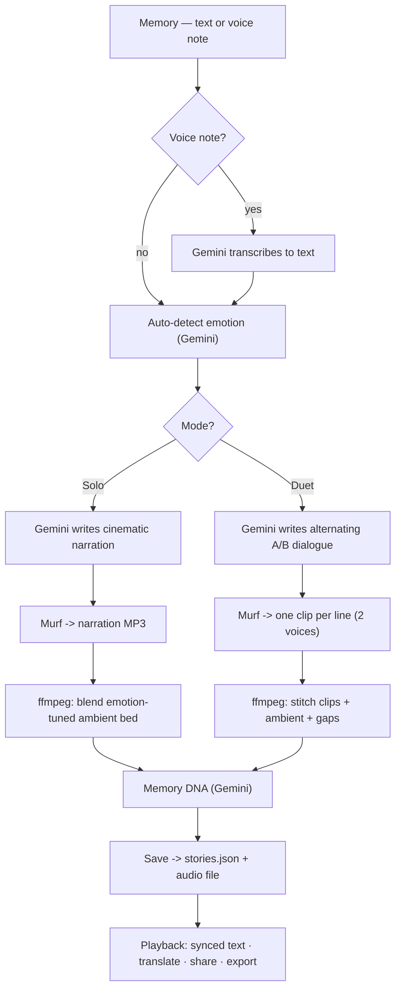

# Echoes

**Your memories deserve a voice.**

Echoes transforms a plain memory into an emotionally narrated, cinematic story —
spoken aloud in an expressive AI voice. Built for the Murf AI Buildathon.

> *"Photos preserve how moments looked. Echoes preserves how they felt."*

**▶ Live demo:** https://echoes-ellg.onrender.com — open it, then click **Demo → Run dual-voice demo**.
*(Free hosting sleeps after ~15 min idle; the first visit wakes it in ~30–50s.)*

Echoes is dressed like a **documentary archive** — bone paper, ink type, oxblood
accents, and film grain — so it feels like a treasured family album, not another AI app.

## Why Echoes

We save photos, videos, and chat logs — but none of them keep the *feeling* of a
moment: the warmth in someone's voice, the atmosphere of being there. When the
people in our memories are gone, so is the sound of them.

Echoes gives a memory back its voice. You write (or speak) a moment; AI turns it
into a short cinematic narration tuned to its emotion; and **Murf speaks it aloud**
— even as a conversation between two people, in two distinct voices. It's less a
tool and more a way to *hear* your past.

## ✦ Signature feature — Dual-Voice Legacy Mode

A memory isn't just yours — it has other people in it. **Dual-Voice Legacy Mode**
turns a single memory into *a conversation across time*: two **distinct Murf
voices** answer each other, line by line — you and your grandfather, or your
younger self and your future self.

The pipeline writes an alternating dialogue, voices each speaker with its own Murf
persona, stitches the clips together with an emotion-tuned ambient bed, and plays
it back as synced left/right speaker bubbles. It's the moment a lost voice
*replies*.

Try it instantly: open `/demo` → **Run dual-voice demo**, or `/create?duet=1`.

## What's inside

- 🎙️ **Dual-Voice Legacy Mode** — two distinct Murf voices in one conversation
- 🎬 **7 story styles** — Netflix documentary, cinematic, Pixar, future-self, letter to younger self, bedtime, motivational
- 🧠 **Emotion intelligence** — auto-detects tone, maps it to Murf style + ambient bed
- 🌍 **Multilingual dubbing** — native Murf voices in English, Hindi, Spanish, French, German
- 🎚️ **Cinematic ambient mix** — emotion-tuned pad blended under narration (ffmpeg)
- 🪐 **Memory Constellation** — 3D interactive map of every memory (React Three Fiber)
- 🧬 **Memory DNA** — AI insight into the emotional themes across your stories
- 🎤 **Voice-note input** — speak your memory; Gemini transcribes it
- 🔗 **Share + export** — public links, MP3/text/JSON download, WhatsApp share

## How it works

1. **Share a memory** — type it, or record a voice note (Gemini transcribes it to text).
2. **AI writes the story** — Gemini rewrites your rough memory into cinematic narration, in the style you pick.
3. **Emotion sets the mood** — the tone (nostalgia, joy, grief, hope) is detected and mapped to a Murf voice style and an ambient music bed.
4. **Murf gives it a voice** — expressive narration is synthesised — one narrator, or *two* in Dual-Voice Legacy Mode.
5. **Cinematic playback** — narration is mixed with the ambient score, the text highlights in sync, and you get a shareable link.

Every AI step has a graceful fallback (local templates / heuristics), so a missing
key or a network blip never hard-fails the demo.

## Quick Start

```bash
# 1. Clone
git clone https://github.com/rogerdemello/echoes.git
cd echoes

# 2. Configure secrets
cp .env.example .env        # then fill in your Murf + Gemini keys

# 3. Install & run
npm install
npm run dev
```

Open [http://localhost:3000](http://localhost:3000)

## Environment Variables

```env
# Required — Murf voice synthesis
MURF_AI_API_KEY=your_murf_api_key

# Required — Google Gemini powers ALL text + audio AI: story enhancement,
# dual-voice dialogue, emotion, Memory DNA, translation, and transcription.
# Free key: https://aistudio.google.com
GEMINI_API_KEY=your_gemini_api_key

# Optional — override the model (default: gemini-2.5-flash)
# GEMINI_MODEL=gemini-2.0-flash

# Optional — absolute base URL for share/OG links in production
NEXT_PUBLIC_APP_URL=https://your-deployment.example.com
```

> All AI runs on **Gemini** (multimodal — one model handles text *and* audio
> transcription). Every AI call degrades gracefully (local templates / heuristics)
> if Gemini is unreachable, so the demo never hard-fails.

## Pages & Workflows

| Route | Workflow |
|-------|----------|
| `/` | Landing page |
| `/create` | Write memory or upload voice note → **Single narrator or Dual voice** → configure → generate |
| `/create?duet=1` | Create page pre-set to Dual-Voice Legacy Mode |
| `/story/[id]` | Cinematic playback (solo player **or** dual-voice conversation bubbles) |
| `/share/[id]` | Public shareable story link |
| `/gallery` | Browse all created Echoes |
| `/constellation` | 3D interactive map of every memory |
| `/demo` | One-click judge demo — solo **and** dual-voice |

## API Endpoints

| Method | Endpoint | Description |
|--------|----------|-------------|
| `GET` | `/api/health` | Service status (Murf, Gemini, transcription) |
| `GET` | `/api/voices` | List Murf voices |
| `POST` | `/api/enhance-story` | AI story enhancement only |
| `POST` | `/api/detect-emotion` | Detect emotion from memory text |
| `POST` | `/api/transcribe` | Voice note → text (multipart `audio`) |
| `GET` | `/api/stories` | List all stories |
| `POST` | `/api/stories` | Full pipeline: enhance + Murf + save (`mode: "solo"` or `"duet"`) |
| `GET` | `/api/stories/[id]` | Get single story |
| `PATCH` | `/api/stories/[id]` | Update story / regenerate voice or text |
| `DELETE` | `/api/stories/[id]` | Delete story |
| `POST` | `/api/stories/[id]/translate` | Generate multilingual version |
| `POST` | `/api/generate-voice` | Regenerate Murf voice for a story |

### Example: Create a story

```bash
curl -X POST http://localhost:3000/api/stories \
  -H "Content-Type: application/json" \
  -d '{
    "originalText": "When I was 10, my father taught me to ride a bike.",
    "storyStyle": "documentary",
    "emotion": "nostalgic",
    "language": "en",
    "narrator": "documentary",
    "autoDetectEmotion": true
  }'
```

### Example: Create a Dual-Voice Legacy story

```bash
curl -X POST http://localhost:3000/api/stories \
  -H "Content-Type: application/json" \
  -d '{
    "originalText": "The last train ride with my grandfather...",
    "mode": "duet",
    "emotion": "nostalgic",
    "language": "en",
    "storyStyle": "documentary",
    "narrator": "documentary",
    "autoDetectEmotion": true,
    "duet": {
      "speakerAName": "Me",
      "speakerBName": "Grandfather",
      "narratorA": "documentary",
      "narratorB": "podcast"
    }
  }'
```

The two `narrator` personas must map to **different** Murf voices
(`documentary`=natalie, `trailer`=ken, `grandmother`=julia, `podcast`=terrell).

### Example: Generate Hindi version

```bash
curl -X POST http://localhost:3000/api/stories/STORY_ID/translate \
  -H "Content-Type: application/json" \
  -d '{"language": "hi"}'
```

## Demo Script (judges)

1. **Opening:** *"Photos preserve how moments looked. Echoes preserves how they felt."*
2. Open `/demo` → **Run dual-voice demo**.
3. Let it build the conversation, then play — **two distinct Murf voices answer
   each other**, bubbles highlighting in sync. *This is the moment a lost voice replies.*
4. Show the constellation (`/constellation`), Memory DNA, and one-tap multilingual dubbing on a solo story.
5. **Close:** *"We didn't build another AI assistant. We gave memories a voice — and a reply."*

## Deployment (live public URL)

**Live at https://echoes-ellg.onrender.com** (Render free tier).

Echoes needs a real server (ffmpeg + local file storage), not serverless. Ship it
as a Docker container — a `Dockerfile` and `render.yaml` blueprint are included.

**Render (recommended):**
1. Push to GitHub:
   ```bash
   git init && git add . && git commit -m "Echoes"
   git branch -M main
   git remote add origin https://github.com/rogerdemello/echoes.git
   git push -u origin main
   ```
2. render.com → **New + → Blueprint** → select the repo (it reads `render.yaml`).
3. Add the secret env vars (`MURF_AI_API_KEY`, `GEMINI_API_KEY`, `NEXT_PUBLIC_APP_URL`).
4. Free tier by default (`plan: free`, no disk). Storage under `/app/data` is
   ephemeral — generated stories/audio reset on restart, and the instance sleeps
   after ~15 min idle (wake it before a demo). For durability + always-on, set
   `plan: starter` and add a `disk` mounted at `/app/data`. Health check: `/api/health`.

**Local container test:**
```bash
docker build -t echoes .
docker run -p 3000:3000 --env-file .env echoes
```

## Architecture

Echoes is a single Next.js app: a React front-end, a set of Node API routes, a
`lib/` domain layer, and three things it talks to — **Murf** (voice), **Google
Gemini** (all text + audio AI), and **ffmpeg** (audio mixing) — with stories and
audio persisted as plain files on disk.



## Workflow — how a memory becomes a story

One `POST /api/stories` runs the whole pipeline. The **solo** and **dual-voice**
paths diverge at the writing step and rejoin at save. Every AI call has a local
fallback, so a missing key or network blip never hard-fails.



> 📹 **Recording a demo?** A full line-by-line video script (with a sample memory
> and every feature in order) lives in [`docs/demo-script.md`](docs/demo-script.md).

## Tech Stack

- Next.js 14 (standalone) · TypeScript · Tailwind CSS · Framer Motion · React Three Fiber
- **Murf API (GEN2 voices)** — solo narration + dual-voice stitching
- **Google Gemini** (multimodal) — story, dialogue, emotion, translation, Memory DNA, audio transcription
- ffmpeg (`ffmpeg-static`) — emotion-tuned ambient mix + multi-clip dialogue stitch
- Local JSON storage (`data/stories.json`) + Docker/Render deploy

## License

MIT
